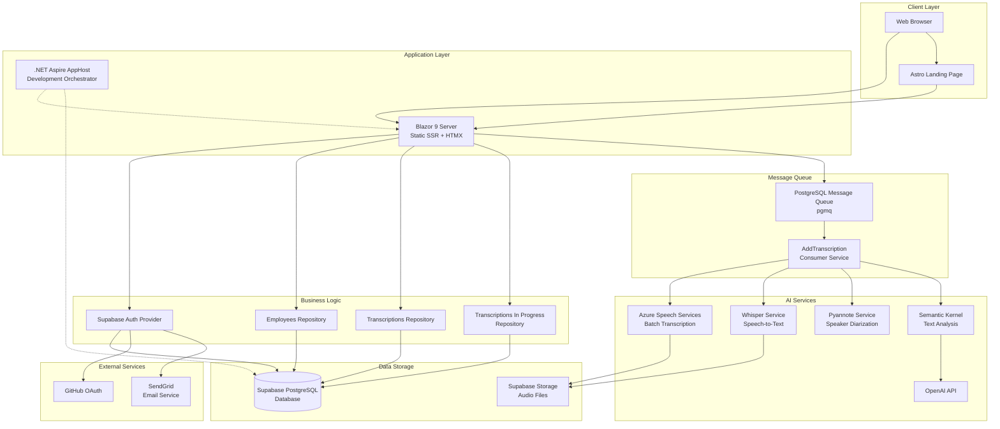

# ConvoClarity - Development Guide

This file provides comprehensive guidance to Claude Code and autonomous agents working with this repository.

## TL;DR

- **Stack**: Blazor 9 Static SSR on .NET 9 with C# 13, Supabase backend, Astro landing page, HTMX for interactivity
- **Quality Gates**: Always run before finishing:
  - `dotnet format && dotnet test` (when touching C# code)
  - `npm run lint && npm run type-check` from `Landing/` (when touching landing page)
  - Report as **PASS/FAIL** in your completion summary
- **Working Principles**:
  - Understand existing code before implementing changes—search, read, and research first
  - Follow existing code patterns and style—consistency over innovation
  - Avoid overengineering and unnecessary complexity—KISS and YAGNI
  - When unsure, ask for clarification rather than making assumptions
- **Architecture**: Repository pattern + feature-based organization + async message queues (PGMQ)

## Project Overview

ConvoClarity is a Blazor 9 web application for audio transcription and conversation analysis, utilizing Static Server-Side Rendering (SSR) with HTMX for interactivity. The project integrates with Supabase for authentication and database, uses various AI services for speech processing, and includes an Astro-based landing page.

### Architecture Diagram



## Repository Structure

- `Blazor/` – Main Blazor 9 Static SSR app organized by feature, components, layouts, Supabase auth
- `Blazor.Client/` – Client-side assets and WebAssembly components (minimal usage)
- `AppHost/` – .NET Aspire orchestrator for local development
- `BlazorTests/` – xUnit test suite using AwesomeAssertions and FakeItEasy
- `Landing/` – Astro-based marketing site (Node 18+, npm)
- `ServiceDefaults/` – Shared service configuration and telemetry
- `supabase/` – Supabase setup, migrations and email templates
- `Directory.Packages.props` – Central package version management

## Key Commands

### .NET Development
```bash
dotnet build             # Build solution
dotnet test              # Run tests
dotnet tool run dotnet-outdated -u:auto      # Update NuGet packages
```

### Landing Page (Astro)
```bash
cd Landing
npm install                    # Install dependencies
npm run dev                    # Development server
npm run build                  # Build for production
npm run lint                   # Lint code
npm run type-check             # TypeScript type checking
npm run format:check           # Check formatting
```

### Supabase Local Development
```bash
supabase init                         # Initialize project
supabase start                        # Start local server
supabase stop                         # Stop local server
supabase status                       # Check status (URLs, ports)
supabase db diff --schema public      # Generate migration diff
supabase migration new <Name>        # Create new migration
```

## Quality Gates ✅

### .NET Solution
```bash
dotnet build             # MUST PASS
dotnet test              # MUST PASS
dotnet format            # Run after code changes
```

### Landing Workspace
```bash
cd Landing
npm run lint && npm run type-check       # MUST PASS
npm run format:check                     # Before committing
```


## Coding Standards & Patterns

### General (Applicable to All Code)

**Core Principles:**
- Follow **SOLID, KISS, YAGNI** principles
- Favor descriptive names over comments
- Add commentary only when intent is unclear
- Async/await for all I/O operations
- Implement proper error handling for all operations
- Provide user feedback for errors

### Blazor App (C# and .NET)

**Architectural Patterns:**

**Repository Pattern**: All data access through repository classes (`EmployeesRepository`, `TranscriptionsRepository`, `TranscriptionsInProgressRepository`)—components never bind directly to Supabase client.

**Feature-Based Organization**: Code organized by features under `Blazor/Features/` with each feature containing its own models, services, and components.

**Message Queue Integration**: PostgreSQL Message Queue (pgmq) for async transcription processing.
- Queue: `add_transcription`
- Consumer: `PgmqAddTranscriptionConsumerBackgroundService`

**Authentication Flow**: Supabase cookie-based sessions via `SupabaseAuthenticationStateProvider`, supports GitHub OAuth and email/password, SendGrid for transactional emails.

**.NET 9 & C# 13 Features:**
- Primary constructors
- Required members
- File-scoped types
- Collection expressions
- Global using directives and implicit usings
- `DateOnly` and `TimeOnly` types where appropriate
- `DateTimeOffset` preferred over `DateTime`

**Localization Requirements:**
- **ALWAYS** provide both English and Polish translations
- Resource files in `Blazor/Resources/`
- Use `IStringLocalizer` for component localization
- PRs lacking Polish translations will be rejected

**Dependency Maintenance:**
- Update packages via `dotnet tool run dotnet-outdated -u:auto`
- Central package management uses `Directory.Packages.props` —update versions there, not in individual `.csproj` files, however `dotnet-outdated` updates correct file automatically

**Code Style:**
- Write idiomatic, efficient Blazor and C# code
- Create dumb, reusable Razor components; move complex logic to services or partial classes
- Keep private helper methods `static` when they don't require instance state
- Skip creating interfaces for single implementations—use virtual members for test seams instead

**Naming Conventions:**
- **PascalCase**: components, methods, public members
- **camelCase**: private fields, local variables
- **I-prefix**: interfaces (e.g., `IUserService`)
- **Repository suffix**: repository classes

**Logging & Error Handling:**
- Use `ILogger<T>` at method entry/exit and in catch blocks
- Wrap risky UI segments in `ErrorBoundary` (or `RedirectErrorBoundary`)
- Provide proper error handling for all API calls with try-catch

**MudBlazor Usage:**
- Use MudBlazor as primary UI framework
- Adapt components for Static SSR compatibility
- Use MudBlazor styling/CSS classes to create custom SSR-compatible components
- Leverage theming and responsive design features

**Blazor 9 Static SSR Constraints**
- **NO** `IJSInProcessRuntime` or JavaScript interop
- **NO** `EventCallbacks`
- **NO** `StateHasChanged()` calls
- **USE** HTMX for dynamic content updates
- **PREFER** CSS/HTML solutions over JavaScript
- MudBlazor components requiring client hydration (e.g., `MudPopover`) won't work—use MudBlazor styling/classes instead
- CSS media queries in Razor: use `@@media` instead of `@media`

### Landing Page (Astro.js and TypeScript)

**TypeScript Configuration** ([`Landing/tsconfig.json`](Landing/tsconfig.json)):

**Code Style:**
- Use ES modules (`import`/`export`), **not** CommonJS (`require`)
- Modern JavaScript conventions:
  - Use `const` for constants (enforced by ESLint)
  - Never use `var` (enforced by ESLint)
  - Avoid unused variables (warned by ESLint)
- Component-based architecture in `src/components/`
- Follow existing patterns in layout files

**Design System:**
- Use **Open Props** for design tokens
- Maintain consistency with existing component styles
- Keep CSS modular and scoped to components

**Tooling & Quality:**
- **ESLint**: Run `npm run lint` or `npm run lint:fix` for auto-correction
- **Prettier**: Run `npm run format` or `npm run format:check`
- **Stylelint**: CSS validation with `stylelint-config-standard`
- **TypeScript**: Run `npm run type-check` (also via `astro check`)

**File Organization:**
- Components in `src/components/`
- Layouts in `src/layouts/`
- Internationalization in `src/i18n/`
- Static assets in `public/`

## Testing Expectations

### General (Applicable to All Code)

**Test Philosophy:**
- Add coverage for every behavioral change
- Favor **sociable tests** exercising real collaborators where practical
- Assert observable outcomes, not mock interactions
- Structure tests with **Arrange, Act, Assert (AAA)**
- Keep tests asynchronous when interacting with async APIs
- Use Docker or Testcontainers for external integrations

### Blazor App (C# and .NET)

**Framework & Tools:**
- **xUnit** for all tests
- **AwesomeAssertions** for readable assertions
- **FakeItEasy** for mocking
- **bUnit** for Razor component tests (when applicable)

**Testing Patterns:**
- When stubbing HTTP, mock `HttpClientHandler` rather than wrapping entire service
- Update fixtures/mocks for new localization strings or schema changes

**Coverage Areas:**
- Services and components in `BlazorTests/`
- Background jobs: cover failure paths (empty payloads, large files, auth issues, rate limits)

### Landing Page (Astro.js and TypeScript)

**Framework & Tools:**
- Follow Astro's testing conventions
- Use modern JavaScript testing patterns
- Leverage TypeScript for type safety in tests

**Testing Patterns:**
- Test components in isolation where possible
- Mock external API calls and dependencies
- Validate accessibility and responsive behavior

## Agent Workflow Tips

### Documentation
- When adding new commands or patterns, update this file so future agents inherit the knowledge
- Update this file whenever you discover new rules, commands, or best practices
- Review `Architecture.md` for deeper context and diagrams