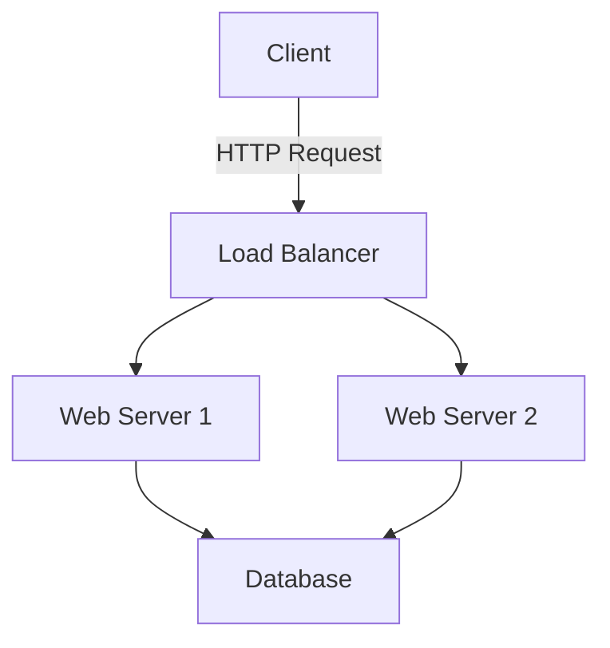

# Documentation Patterns and Best Practices

This skill provides comprehensive documentation guidelines and patterns that are automatically activated during documentation creation and updates.

## Purpose

Automatically activated when:
- Creating or updating documentation
- Writing technical specifications
- Documenting APIs
- Creating user guides
- Writing architecture documents
- Maintaining project documentation

## Documentation Principles

### The Four Types of Documentation

**1. Tutorials (Learning-Oriented)**
- Goal: Help beginners learn
- Focus: Taking the user by the hand
- Format: Step-by-step lessons
- Example: "Your First API Call"

**2. How-To Guides (Task-Oriented)**
- Goal: Show how to solve specific problems
- Focus: Practical steps to achieve a goal
- Format: Recipes and procedures
- Example: "How to Deploy to Production"

**3. Reference (Information-Oriented)**
- Goal: Describe the machinery
- Focus: Technical accuracy
- Format: Structured descriptions
- Example: "API Endpoint Reference"

**4. Explanation (Understanding-Oriented)**
- Goal: Clarify and illuminate topics
- Focus: Background and context
- Format: Discussions and analysis
- Example: "Why We Chose This Architecture"

## Documentation Structure

### README.md Structure

**Essential Sections:**
```markdown
# Project Name

Brief one-line description

## Features

- Key feature 1
- Key feature 2
- Key feature 3

## Installation

```bash
npm install project-name
```

## Quick Start

```javascript
// Minimal working example
const lib = require('project-name');
lib.doSomething();
```

## Usage

Detailed usage examples

## API Reference

Link to full API docs

## Configuration

Configuration options

## Contributing

Link to CONTRIBUTING.md

## License

License information
```

See the `readme-guidelines` skill for detailed README best practices.

### API Documentation Structure

**Endpoint Documentation Template:**
```markdown
## GET /api/users/:id

Retrieve a user by ID.

**Authentication:** Required

**Parameters:**
- `id` (string, required): User unique identifier

**Query Parameters:**
- `include` (string, optional): Comma-separated related resources
  - Allowed values: `posts`, `comments`, `profile`

**Request Headers:**
```
Authorization: Bearer <token>
Accept: application/json
```

**Response (200 OK):**
```json
{
  "id": "user123",
  "username": "johndoe",
  "email": "john@example.com",
  "createdAt": "2024-01-15T10:30:00Z"
}
```

**Error Responses:**

- `400 Bad Request`: Invalid user ID format
  ```json
  {
    "error": "Invalid ID format",
    "message": "ID must be alphanumeric"
  }
  ```

- `401 Unauthorized`: Missing or invalid authentication
- `404 Not Found`: User does not exist
- `500 Internal Server Error`: Server error

**Example:**
```bash
curl -X GET "https://api.example.com/api/users/user123" \
  -H "Authorization: Bearer your-token"
```
```

### Architecture Documentation

**Architecture Document Template:**
```markdown
# System Architecture

## Overview

High-level description of the system

## Architecture Diagram

[Include diagram using Mermaid, PlantUML, or image]

## Components

### Component Name

**Purpose:** What this component does

**Responsibilities:**
- Responsibility 1
- Responsibility 2

**Technology Stack:**
- Language/Framework
- Database
- External services

**Interfaces:**
- API endpoints
- Event listeners
- Database connections

## Data Flow

Description and diagram of how data moves through the system

## Security Architecture

Authentication, authorization, encryption

## Scalability

How the system scales

## Deployment Architecture

Infrastructure and deployment strategy

## Decision Log

Key architectural decisions and rationale
```

### Code Documentation

**Function/Method Documentation:**

**JavaScript (JSDoc):**
```javascript
/**
 * Calculates the total price including tax
 * 
 * @param {number} price - The base price
 * @param {number} taxRate - The tax rate as a decimal (e.g., 0.08 for 8%)
 * @returns {number} The total price with tax applied
 * @throws {Error} If price or taxRate is negative
 * @example
 * calculateTotal(100, 0.08); // Returns 108
 */
function calculateTotal(price, taxRate) {
  if (price < 0 || taxRate < 0) {
    throw new Error('Price and tax rate must be non-negative');
  }
  return price * (1 + taxRate);
}
```

**Python (Docstring):**
```python
def calculate_total(price: float, tax_rate: float) -> float:
    """
    Calculate the total price including tax.
    
    Args:
        price: The base price (must be non-negative)
        tax_rate: The tax rate as a decimal (e.g., 0.08 for 8%)
    
    Returns:
        The total price with tax applied
    
    Raises:
        ValueError: If price or tax_rate is negative
    
    Examples:
        >>> calculate_total(100, 0.08)
        108.0
    """
    if price < 0 or tax_rate < 0:
        raise ValueError('Price and tax rate must be non-negative')
    return price * (1 + tax_rate)
```

**Java (Javadoc):**
```java
/**
 * Calculates the total price including tax.
 * 
 * @param price The base price (must be non-negative)
 * @param taxRate The tax rate as a decimal (e.g., 0.08 for 8%)
 * @return The total price with tax applied
 * @throws IllegalArgumentException if price or taxRate is negative
 * @example
 * double total = calculateTotal(100.0, 0.08); // Returns 108.0
 */
public double calculateTotal(double price, double taxRate) {
    if (price < 0 || taxRate < 0) {
        throw new IllegalArgumentException("Price and tax rate must be non-negative");
    }
    return price * (1 + taxRate);
}
```

### Change Log

**CHANGELOG.md Structure (Keep a Changelog):**
```markdown
# Changelog

All notable changes to this project will be documented in this file.

The format is based on [Keep a Changelog](https://keepachangelog.com/en/1.0.0/),
and this project adheres to [Semantic Versioning](https://semver.org/spec/v2.0.0.html).

## [Unreleased]

### Added
- New feature description

### Changed
- Change description

### Deprecated
- Soon-to-be removed features

### Removed
- Removed features

### Fixed
- Bug fix description

### Security
- Security fix description

## [1.2.0] - 2024-01-15

### Added
- User profile page with avatar upload
- Email notification system
- Two-factor authentication support

### Fixed
- Memory leak in data processing
- Incorrect date formatting in exports

## [1.1.0] - 2024-01-01

[Previous releases...]

[Unreleased]: https://github.com/user/repo/compare/v1.2.0...HEAD
[1.2.0]: https://github.com/user/repo/compare/v1.1.0...v1.2.0
[1.1.0]: https://github.com/user/repo/releases/tag/v1.1.0
```

## Documentation Best Practices

### Writing Style

**Clarity:**
- Use simple, direct language
- Short sentences and paragraphs
- Active voice over passive
- Present tense
- Clear headings and structure

**Consistency:**
- Consistent terminology
- Consistent formatting
- Consistent code examples
- Consistent voice and tone

**Completeness:**
- Cover all features
- Include examples
- Document edge cases
- Explain error conditions
- Provide troubleshooting

### Code Examples

**Good Code Examples:**
- Runnable and tested
- Realistic use cases
- Include imports/setup
- Show expected output
- Cover common scenarios
- Demonstrate best practices

**Example Structure:**
```markdown
### Basic Usage

```javascript
// Import the library
const validator = require('input-validator');

// Create a validator instance
const v = new validator();

// Validate email
const result = v.email('user@example.com');

if (result.valid) {
  console.log('Email is valid');
} else {
  console.log('Error:', result.error);
}
```

**Output:**
```
Email is valid
```
```

### Visual Elements

**Diagrams:**
- Use Mermaid for inline diagrams
- Use draw.io or Excalidraw for complex diagrams
- Include both image and source
- Keep diagrams up-to-date
- Use consistent styling

**Mermaid Example:**
```markdown

```

**Screenshots:**
- Use for UI documentation
- Annotate with arrows/highlights
- Keep resolution reasonable
- Update with UI changes
- Compress images

### Tables

**Use Tables For:**
- Configuration options
- API parameters
- Comparison data
- Status codes
- Feature matrices

**Table Example:**
```markdown
| Parameter | Type | Required | Default | Description |
|-----------|------|----------|---------|-------------|
| name | string | Yes | - | User's full name |
| age | number | No | 0 | User's age |
| email | string | Yes | - | Valid email address |
```

### Links and References

**Link Best Practices:**
- Use descriptive link text
- Link to specific sections
- Use relative links for internal docs
- Check links regularly
- Provide context for external links

**Good Links:**
```markdown
See the [Authentication Guide](./auth.md) for setup instructions.
For more details, check out the [API Reference](./api.md#users).
```

**Bad Links:**
```markdown
Click [here](./auth.md) for more info.
More details [here](./api.md).
```

## Documentation Maintenance

### Keeping Documentation Current

**Strategies:**
- Review docs with code reviews
- Automate what you can
- Set up doc-only PRs
- Regular documentation audits
- Deprecation notices
- Version documentation

**Documentation Checklist for PRs:**
- [ ] API changes documented
- [ ] README updated if needed
- [ ] Code comments added/updated
- [ ] Examples updated
- [ ] Changelog entry added
- [ ] Breaking changes noted

### Documentation Testing

**Test Documentation:**
- Run code examples in tests
- Use tools like `doctest` (Python)
- Validate links (markdown-link-check)
- Check code formatting
- Verify API documentation matches code

### Deprecation Documentation

**Deprecation Notice Template:**
```markdown
## ⚠️ Deprecated

This method is deprecated as of version 2.0.0 and will be removed in version 3.0.0.

**Reason:** This approach has been superseded by a more efficient method.

**Migration:**
```javascript
// Old (deprecated)
user.getName();

// New
user.profile.name;
```

**Alternative:** Use `user.profile.name` instead.
```

## Documentation Tools

### Static Site Generators

**For Technical Docs:**
- **Docusaurus** - React-based, excellent for versioned docs
- **VitePress** - Vue-based, fast and modern
- **MkDocs** - Python-based, simple and elegant
- **GitBook** - User-friendly, good for non-technical writers

**For API Docs:**
- **Swagger/OpenAPI** - REST API documentation
- **GraphQL Playground** - GraphQL API documentation
- **Redoc** - OpenAPI-based, beautiful API docs
- **Stoplight** - API design and documentation

### Documentation Generators

**From Code:**
- **JSDoc** - JavaScript
- **TypeDoc** - TypeScript
- **Sphinx** - Python
- **Javadoc** - Java
- **rustdoc** - Rust
- **godoc** - Go

### Diagramming Tools

- **Mermaid** - Markdown-based diagrams
- **PlantUML** - UML diagrams from text
- **draw.io** - Visual diagram editor
- **Excalidraw** - Hand-drawn style diagrams
- **Lucidchart** - Professional diagramming

## Special Documentation Types

### Runbooks

**Runbook Template:**
```markdown
# Service Restart Runbook

## Overview
This runbook describes how to restart the application service.

## Prerequisites
- SSH access to production servers
- Sudo privileges
- Access to monitoring dashboard

## Steps

### 1. Check Service Status
```bash
sudo systemctl status app-service
```

### 2. Stop Service
```bash
sudo systemctl stop app-service
```

### 3. Verify Service Stopped
```bash
sudo systemctl status app-service
# Should show "inactive (dead)"
```

### 4. Start Service
```bash
sudo systemctl start app-service
```

### 5. Verify Service Started
```bash
sudo systemctl status app-service
# Should show "active (running)"
```

### 6. Check Logs
```bash
sudo journalctl -u app-service -n 50
```

## Verification
- [ ] Service is running
- [ ] No errors in logs
- [ ] Health check endpoint responding
- [ ] Monitoring shows normal metrics

## Rollback
If issues occur:
1. Stop the service
2. Restore previous version
3. Start the service
4. Notify team

## Troubleshooting
- **Service won't start:** Check configuration files
- **Service crashes immediately:** Check logs for errors
- **Port already in use:** Identify and stop conflicting process
```

### ADR (Architecture Decision Records)

**ADR Template:**
```markdown
# ADR 001: Use PostgreSQL for Primary Database

## Status
Accepted

## Context
We need to choose a database for our application. The application requires:
- ACID transactions
- Complex queries with joins
- Relational data model
- Strong consistency

## Decision
We will use PostgreSQL as our primary database.

## Consequences

### Positive
- Strong ACID guarantees
- Excellent query performance
- Rich feature set (JSON, full-text search, etc.)
- Mature and well-supported
- Good tooling ecosystem

### Negative
- Vertical scaling limitations
- More complex to operate than NoSQL alternatives
- Requires careful schema design

### Risks
- Need expertise in PostgreSQL optimization
- Backup and recovery procedures critical

## Alternatives Considered

### MongoDB
- Pros: Flexible schema, horizontal scaling
- Cons: Eventual consistency, weaker transactions
- Why not chosen: ACID requirements are critical

### MySQL
- Pros: Widely known, good performance
- Cons: Less advanced features than PostgreSQL
- Why not chosen: Need advanced features like JSON support
```

## Documentation Checklist

### Before Publishing

- [ ] All sections complete
- [ ] Code examples tested
- [ ] Links verified
- [ ] Images optimized
- [ ] Spelling/grammar checked
- [ ] Technical accuracy verified
- [ ] Examples follow best practices
- [ ] Version information included
- [ ] Contact/support info provided

### Content Quality

- [ ] Clear and concise
- [ ] Appropriate detail level
- [ ] Logical organization
- [ ] Good examples
- [ ] Troubleshooting section
- [ ] Next steps provided
- [ ] Searchable content

## Common Documentation Mistakes

**Avoid:**
- Assuming prior knowledge
- Outdated examples
- Broken links
- Missing prerequisites
- Vague instructions
- No code examples
- Wall of text (poor formatting)
- Inconsistent terminology
- Missing error documentation
- No version information

## Usage by Agents

This skill is automatically available to:
- All agents when creating or updating documentation
- Particularly useful for documentation-focused tasks
- Referenced during code reviews for documentation quality
- Applied when generating technical specifications

The skill ensures consistent, high-quality documentation across all projects.
