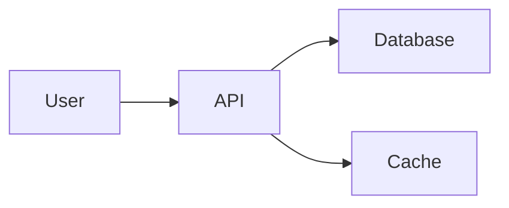

# README Guidelines and Best Practices

This skill provides comprehensive guidelines for creating effective README.md files that serve as the primary documentation entry point for projects.

## Purpose

Automatically activated when:
- Creating new README files
- Updating project documentation
- Reviewing README content
- Setting up new projects
- Improving documentation quality

## README Anatomy

### Essential Sections

Every README should include:
1. Project title and description
2. Key features
3. Installation instructions
4. Quick start / Usage examples
5. Documentation links
6. Contributing guidelines
7. License information

### Complete README Template

```markdown
# Project Name

[](LICENSE)
[]()
[]()

One-line project description that clearly states what the project does and its primary benefit.


## 📋 Table of Contents

- [Features](#features)
- [Installation](#installation)
- [Quick Start](#quick-start)
- [Usage](#usage)
- [API Reference](#api-reference)
- [Configuration](#configuration)
- [Examples](#examples)
- [Contributing](#contributing)
- [Testing](#testing)
- [Deployment](#deployment)
- [FAQ](#faq)
- [Support](#support)
- [Roadmap](#roadmap)
- [License](#license)
- [Acknowledgments](#acknowledgments)

## ✨ Features

- **Feature 1**: Brief description highlighting the value
- **Feature 2**: Brief description highlighting the value
- **Feature 3**: Brief description highlighting the value
- **Feature 4**: Brief description highlighting the value

## 🚀 Installation

### Prerequisites

- Node.js >= 14.0.0
- npm or yarn
- Other requirements

### Install via npm

```bash
npm install project-name
```

### Install via yarn

```bash
yarn add project-name
```

### Install from source

```bash
git clone https://github.com/username/project-name.git
cd project-name
npm install
npm run build
```

## 🎯 Quick Start

Get up and running in 60 seconds:

```javascript
const ProjectName = require('project-name');

// Create instance
const instance = new ProjectName({
  apiKey: 'your-api-key'
});

// Use the library
const result = await instance.doSomething();
console.log(result);
```

## 💡 Usage

### Basic Usage

```javascript
// Detailed usage example
```

### Advanced Usage

```javascript
// Advanced usage example
```

## 📚 API Reference

Brief overview of main APIs. Link to full documentation:
[Full API Documentation](docs/API.md)

### Main Methods

#### `methodName(param1, param2)`

Description of what the method does.

**Parameters:**
- `param1` (type): Description
- `param2` (type): Description

**Returns:** Description of return value

**Example:**
```javascript
const result = instance.methodName('value1', 'value2');
```

## ⚙️ Configuration

Configuration options and their defaults:

```javascript
const config = {
  option1: 'default value',  // Description
  option2: true,             // Description
  option3: 1000             // Description
};
```

### Environment Variables

- `API_KEY`: Your API key (required)
- `DEBUG`: Enable debug mode (optional)
- `PORT`: Server port (default: 3000)

## 📖 Examples

### Example 1: Common Use Case

```javascript
// Example code
```

### Example 2: Advanced Scenario

```javascript
// Example code
```

More examples in the [examples directory](examples/).

## 🤝 Contributing

We welcome contributions! Please see [CONTRIBUTING.md](CONTRIBUTING.md) for details.

### Quick Contribution Guide

1. Fork the repository
2. Create your feature branch (`git checkout -b feature/AmazingFeature`)
3. Commit your changes (`git commit -m 'Add some AmazingFeature'`)
4. Push to the branch (`git push origin feature/AmazingFeature`)
5. Open a Pull Request

## 🧪 Testing

Run the test suite:

```bash
npm test
```

Run tests with coverage:

```bash
npm run test:coverage
```

## 🚢 Deployment

Instructions for deploying to production:

```bash
npm run build
npm run deploy
```

For detailed deployment instructions, see [DEPLOYMENT.md](docs/DEPLOYMENT.md).

## ❓ FAQ

**Q: Common question?**
A: Answer to common question.

**Q: Another common question?**
A: Answer to another question.

For more questions, see [FAQ](docs/FAQ.md) or open an issue.

## 💬 Support

- 📧 Email: support@example.com
- 💬 Discord: [Join our server](https://discord.gg/example)
- 🐛 Issues: [GitHub Issues](https://github.com/username/project/issues)
- 📚 Docs: [Documentation Site](https://docs.example.com)

## 🗺️ Roadmap

- [ ] Feature 1 (Q1 2024)
- [ ] Feature 2 (Q2 2024)
- [ ] Feature 3 (Q3 2024)

See [ROADMAP.md](ROADMAP.md) for detailed plans.

## 📄 License

This project is licensed under the MIT License - see the [LICENSE](LICENSE) file for details.

## 🙏 Acknowledgments

- Person/Project that helped
- Inspiration sources
- Third-party libraries used

## 📊 Project Stats


---

Made with ❤️ by [Your Name](https://github.com/username)
```

## Section Guidelines

### Project Title and Description

**Title:**
- Clear and descriptive
- Matches package/repository name
- Easy to remember

**Description:**
- One-line elevator pitch
- Answers "What is this?"
- Highlights primary benefit
- Under 150 characters

**Good Examples:**
```markdown
# FastAPI

FastAPI framework, high performance, easy to learn, fast to code, ready for production

# React

A JavaScript library for building user interfaces

# Tailwind CSS

A utility-first CSS framework for rapidly building custom user interfaces
```

### Badges

**Common Badge Types:**
- Build status
- Test coverage
- Version
- License
- Downloads
- Dependencies status
- Documentation status

**Badge Services:**
- shields.io
- badgen.net
- GitHub Actions badges

**Best Practices:**
- Don't overuse badges
- Keep badges relevant
- Place at top after title
- Align horizontally
- Use consistent style

### Features Section

**Feature Writing:**
- Focus on benefits, not just features
- Be specific and concrete
- Use active voice
- Highlight what makes project unique
- Keep list concise (4-8 items)

**Good Feature Descriptions:**
```markdown
## Features

- **Zero Configuration**: Works out of the box with sensible defaults
- **Type Safety**: Full TypeScript support with complete type definitions
- **Blazing Fast**: Built on modern tooling for optimal performance
- **Developer Experience**: Hot reload, helpful errors, and great debugging
```

**Poor Feature Descriptions:**
```markdown
## Features

- Has types
- Is fast
- Easy to use
- Works well
```

### Installation Section

**Requirements:**
- List prerequisites clearly
- Include version requirements
- Mention system dependencies
- Link to installation guides for dependencies

**Multiple Installation Methods:**
- Package manager (npm, pip, etc.)
- Download binary
- Install from source
- Docker image
- Platform-specific instructions

**Installation Best Practices:**
- Test all installation methods
- Include expected output
- Troubleshoot common issues
- Version-specific instructions
- OS-specific notes

### Quick Start Section

**Purpose:**
- Get users to success quickly
- Show simplest possible usage
- Demonstrate core functionality
- Build user confidence

**Quick Start Characteristics:**
- Under 60 seconds to complete
- Copy-paste ready
- Minimal configuration
- Shows actual output
- Leads naturally to documentation

**Example Structure:**
```markdown
## Quick Start

### 1. Install

```bash
npm install awesome-lib
```

### 2. Create a file

```javascript
// app.js
const awesome = require('awesome-lib');
awesome.init();
```

### 3. Run

```bash
node app.js
```

**Output:**
```
✓ Awesome lib initialized!
```

**Next Steps:** Check out the [full tutorial](docs/tutorial.md)
```

### Usage Section

**Detailed Examples:**
- Multiple common scenarios
- Gradually increasing complexity
- Real-world use cases
- Complete, runnable code
- Expected results

**Code Example Best Practices:**
- Include imports and setup
- Use realistic variable names
- Add comments where helpful
- Show expected output
- Handle errors appropriately

### API Reference

**In README:**
- High-level overview
- Most common APIs
- Link to full documentation
- Quick reference format

**Link to Separate Docs:**
- Full API documentation
- Detailed parameter descriptions
- All methods and properties
- Advanced usage

### Configuration Section

**Configuration Documentation:**
- All available options
- Default values
- Valid values/ranges
- Example configurations
- Environment variables

**Configuration Examples:**
```markdown
## Configuration

### File-based Configuration

Create `config.json`:

```json
{
  "port": 3000,
  "timeout": 5000,
  "retries": 3
}
```

### Environment Variables

```bash
export API_KEY="your-key-here"
export DEBUG=true
export LOG_LEVEL=info
```

### Programmatic Configuration

```javascript
const app = new App({
  port: 3000,
  timeout: 5000,
  retries: 3
});
```
```

### Examples Section

**Example Types:**
- Basic usage
- Common scenarios
- Advanced features
- Integration examples
- Real-world applications

**Example Organization:**
- Inline for simple examples
- Separate directory for complex ones
- Working, tested code
- README in examples directory
- Link to live demos

### Contributing Section

**Contributing Information:**
- Link to CONTRIBUTING.md
- Quick contribution steps
- Code of conduct link
- Development setup
- Testing requirements
- PR process overview

**Encourage Contributions:**
- Welcoming tone
- Clear guidelines
- Recognize contributors
- Good first issues label
- Thank contributors

## Visual Elements

### Screenshots and GIFs

**When to Use:**
- UI/visual projects
- CLI tools
- Installation process
- Complex workflows
- Before/after comparisons

**Best Practices:**
- High quality but optimized size
- Show actual product, not mockups
- Keep up-to-date with UI changes
- Use GIFs for animations
- Add alt text for accessibility

**GIF Tools:**
- LICEcap
- Kap
- Recordit
- Giphy Capture

### Diagrams

**Use Diagrams For:**
- Architecture overview
- Data flow
- System components
- Process flows
- Relationships

**Diagram Tools:**
- Mermaid (in markdown)
- Draw.io
- Excalidraw
- PlantUML

**Mermaid Example:**
```markdown

```

## README Best Practices

### Writing Style

**Do:**
- Use clear, simple language
- Write for beginners
- Use active voice
- Be concise but complete
- Use consistent terminology
- Include examples
- Test all code examples

**Don't:**
- Assume knowledge
- Use jargon without explanation
- Write walls of text
- Include broken examples
- Forget to update
- Oversell or exaggerate

### Structure and Organization

**Do:**
- Use table of contents for long READMEs
- Group related information
- Use clear headings
- Maintain logical flow
- Make it scannable
- Highlight important information

**Don't:**
- Mix different topics
- Use unclear headings
- Bury important information
- Create overly long sections
- Skip headings

### Maintenance

**Keep README Updated:**
- Update with major changes
- Fix broken links
- Update screenshots
- Refresh examples
- Update versions
- Check dependencies

**README Review Checklist:**
- [ ] All links work
- [ ] Examples run successfully
- [ ] Installation steps tested
- [ ] Screenshots current
- [ ] Version information correct
- [ ] No spelling/grammar errors
- [ ] Badge status accurate

## README for Different Project Types

### Library/Package README

**Focus On:**
- Installation
- Quick start
- API reference
- Code examples
- Integration examples

### Application README

**Focus On:**
- What it does
- How to run it
- Configuration
- Deployment
- User guides

### CLI Tool README

**Focus On:**
- Installation
- Command reference
- Usage examples
- Configuration
- Output examples

### Plugin/Extension README

**Focus On:**
- Installation in host app
- Configuration
- Available features
- Extension points
- Examples

## Internationalization

### Multiple Languages

**Supporting i18n:**
- Provide README in multiple languages
- Name files: README.md, README.zh-CN.md, README.es.md
- Link to translations at top
- Keep translations synchronized
- Use native speakers for translation

**Translation Links:**
```markdown
# Project Name

[English](README.md) | [中文](README.zh-CN.md) | [Español](README.es.md)
```

## Accessibility

**Accessible READMEs:**
- Use descriptive link text
- Add alt text to images
- Use semantic headings
- Provide text alternatives for visual information
- Use sufficient color contrast
- Test with screen readers

## README Checklist

### Content Completeness

- [ ] Clear project description
- [ ] Installation instructions
- [ ] Quick start guide
- [ ] Usage examples
- [ ] API documentation or link
- [ ] Contributing guidelines
- [ ] License information
- [ ] Contact/support information

### Quality Checks

- [ ] All links work
- [ ] Examples are tested and work
- [ ] No spelling or grammar errors
- [ ] Images are optimized
- [ ] Badges are accurate
- [ ] Version numbers are correct
- [ ] No outdated information

### Usability

- [ ] Easy to scan
- [ ] Logical organization
- [ ] Clear headings
- [ ] Sufficient examples
- [ ] Appropriate detail level
- [ ] Table of contents (if long)
- [ ] Next steps are clear

## Common README Mistakes

**Avoid:**
- No description or vague description
- Missing installation instructions
- No examples
- Broken or outdated links
- Assuming too much knowledge
- Too technical for beginners
- Outdated screenshots
- No license information
- Missing prerequisites
- Unclear project status (active, maintained, archived)

## README Generation Tools

**Tools to Help:**
- **readme-md-generator**: Interactive CLI
- **standard-readme**: Specification and tools
- **make-readme-markdown**: Template-based generator
- **Github README Stats**: Dynamic stats
- **Shields.io**: Badge generation

## Advanced README Features

### Dynamic Content

**GitHub Actions:**
- Auto-update statistics
- Generate documentation
- Update version numbers
- Refresh examples

### Interactive Elements

**Collapsible Sections:**
```markdown
<details>
<summary>Click to expand</summary>

Hidden content here
</details>
```

**Tables:**
```markdown
| Feature | Description | Status |
|---------|-------------|--------|
| Auth | User authentication | ✅ Done |
| API | REST API | 🚧 In Progress |
| Tests | Unit tests | ⏳ Planned |
```

## README Templates by Type

### Minimal README
```markdown
# Project Name

Brief description

## Installation

```bash
npm install project-name
```

## Usage

```javascript
const project = require('project-name');
```

## License

MIT
```

### Standard README
See complete template above in "Complete README Template" section.

### Comprehensive README
Include all sections plus:
- Architecture documentation
- Performance benchmarks
- Comparison with alternatives
- Migration guides
- Troubleshooting
- Glossary
- References

## Usage by Agents

This skill is automatically available to:
- All agents when creating or updating README files
- Documentation-focused agents
- Project initialization workflows
- During repository setup

The skill ensures README files are informative, well-structured, and follow best practices.
